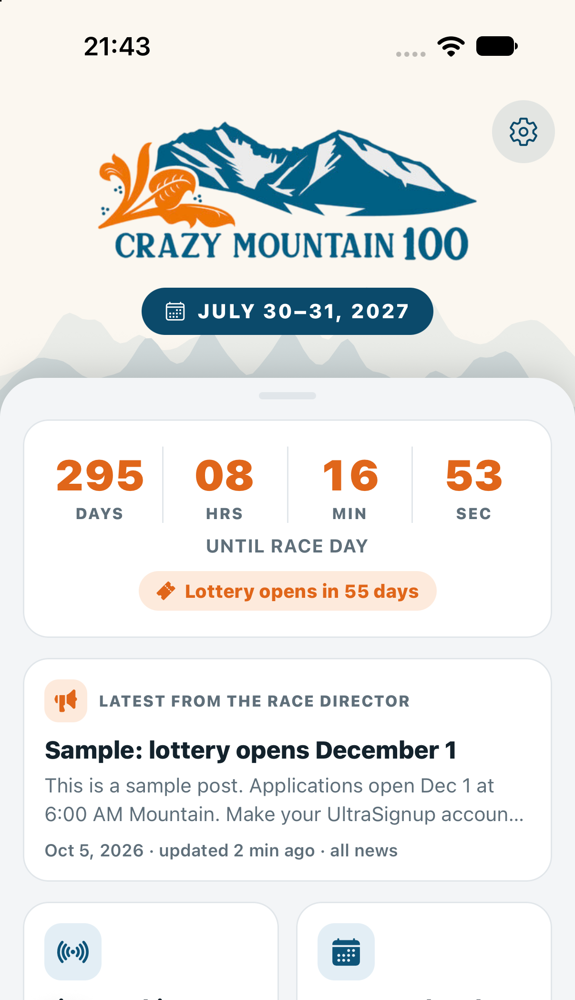
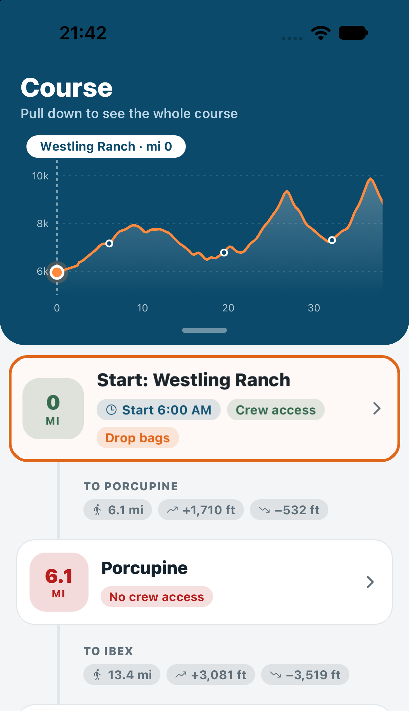
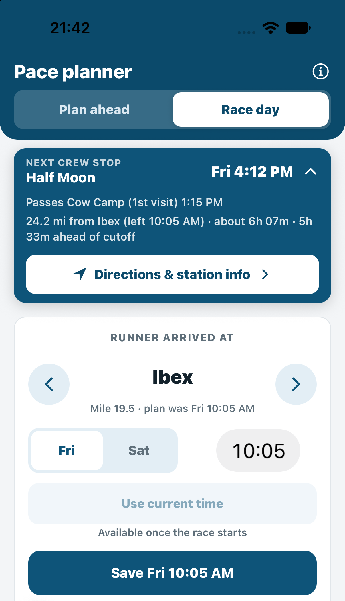

# CM100 Companion

CM100 Companion is an unofficial companion app for the [Crazy Mountain 100](https://www.crazymountainultra.com), a 100-mile point-to-point
mountain ultramarathon from Wilsall to Lennep, Montana. It is built for runners, crew and pacers, and it is designed to
keep working with little or no cell service, because most of the course has none.

<p align="center">
  
  &nbsp;
  
  &nbsp;
  
</p>

<p align="center"><sub>Home, Course and Pace planner. The news post on Home is sample content.</sub></p>

> **Unofficial.** Course, aid station and rules information comes from the race's public website and its published
> crew materials. Details change from year to year, so always confirm with the race.

## What's in the app

| Tab | What it does |
|---|---|
| **Home** | Live countdown to the start, a race weekend card once race week begins (next event, shortcuts), the latest post from the race director, typical or forecast weather, and quick links to the schedule, gear checklists, crew and pacer rules, emergency contacts, food and lodging, and the lottery. |
| **Course** | An interactive elevation profile you can swipe along, with every aid station, section distance, climb and descent, crew and pacer access, drop bags and cutoffs. Tap a station for the full details. |
| **Map** | The course line and aid stations on a map (Terrain, Hybrid or Satellite), your own location, GPX download, and a link to live runner tracking. |
| **Planner** | Plan a finish time and see when your runner reaches each station, then track them on race day. See below. |

### Pace planner

The planner has two modes:

- **Plan ahead.** Choose a goal finish time and see an estimated arrival time at every aid station, how far ahead of or
  behind each cutoff that puts you, and when crew has to leave the previous crew stop to meet the runner.
- **Race day.** Log the time your runner passes each station. A collapsible **Next crew stop** card shows the next place
  crew can reach, with arrival time, when to leave and a link to directions. Logging more stations makes every
  later time more accurate.

How the estimates work:

- Arrival times come from finisher split tables in the race's crew planning sheet (27 to 34 hour finishes), blended to
  match your goal. They carry the shape of the course, so climbs are slow legs and descents are fast ones.
- On race day every logged time is used, with recent stations weighted more. Early in the race your goal still counts, so one
  fast first leg does not turn into a "this pace for the whole race" prediction. By about halfway the logged pace takes over.
- Crew "leave by" times assume your runner spends 10 minutes at each crewed station, use 2025 drive times, and add 15
  minutes each way for the hike into Sunlight.

These are estimates, not predictions. Weather, conditions and aid station stops all change real times.

### Works offline

- The countdown, schedule, course, gear lists, aid station details and the planner need no signal.
- News and weather are saved on the phone and show when they were last updated.
- The Map's background tiles need signal. The course line, aid stations and your GPS position still draw without it.
- A banner explains what still works whenever the phone has no connection.

### Settings

Reached from the gear icon on Home: Automatic, Light or Dark appearance, and resets for race day
times, the goal time, gear checkmarks and saved news and weather.

## Tech

- [Expo](https://expo.dev) SDK 57 with [Expo Router](https://docs.expo.dev/router/introduction/), React Native 0.86, TypeScript
- `react-native-maps`, `react-native-svg` (elevation chart), `expo-location`
- `@react-native-async-storage/async-storage` for everything saved on the phone (no accounts, no backend)
- Weather from [Open-Meteo](https://open-meteo.com) (free, no key); news from a Google Sheet the race director edits

## Getting started

```bash
npm install
npx expo start
```

Then open the project on a phone with [Expo Go](https://expo.dev/go) by scanning the QR code, or press `i` for the iOS
simulator or `a` for an Android emulator. The phone and computer need to be on the same Wi-Fi network. If they can't
see each other, use `npx expo start --tunnel`.

Always add packages with `npx expo install <package>` so versions match the SDK. Before finishing a change:

```bash
npx tsc --noEmit
```

## Web version

The app also runs as a website, so anyone can open it from a link on a phone and add it to their home screen. No app
store or developer account is needed.

```bash
npm run build:web      # exports a static site to dist/
```

Upload the `dist/` folder to any static host. For example, drag it onto [Netlify Drop](https://app.netlify.com/drop).
`public/_redirects` (Netlify, Cloudflare Pages) and `vercel.json` (Vercel) send every path to `index.html`, which the
app's routing needs. To try it locally, run `npx serve -s dist`.

Differences from the mobile app:

- **Map:** the interactive map is native-only. On the web the Map tab draws the course and aid stations itself and links
  each station out to a maps app.
- **Time entry** in the planner uses the browser's own time field, and confirmations use the browser's dialogs.
- **Appearance** follows the browser or system theme (the Light/Dark setting is mobile only).
- Offline use is limited to what the browser has cached. For race weekend, the native app is the better choice.

## Project layout

```
app/                 Screens (Expo Router). (tabs)/ holds the four tabs
  aid/[id].tsx       Aid station detail
  info/[slug].tsx    Schedule, crew rules, emergency, local info
  settings.tsx       Settings
src/
  alert.ts           Alert that also works on the web
  components/        Shared UI (cards, headers, list rows, elevation chart)
  data/              Race facts, aid stations, pace model, news, weather
  settings.ts        Theme preference and storage keys for Settings
  theme.ts           Colors for light and dark
data/                Source course GPX and raw elevation lookups
scripts/             Builds the course and elevation JSON from the GPX
docs/                News guide for the race director, news sheet template
```

Key files:

- `src/data/pace.ts` holds the finisher curves, cutoffs, drive times, `projectFromLogs` and `crewLeg`.
- `src/data/aidStations.ts` holds every station: mile, climb and descent, crew and pacer access, drop bags, cutoffs.
- `src/data/race.ts` holds the race facts and links. Update these each year.

### Updating each year

1. Update `src/data/race.ts` (dates, start time, tracking URL).
2. Review `src/data/aidStations.ts`, the cutoffs and drive times in `src/data/pace.ts`, and the pages in `src/data/info.ts`.
3. If the course changes, replace `data/CM100.gpx`, then run `npm run build:course`. Elevation is looked up
   by `scripts/fetch-elevation.mjs`.

### Race news

News comes from a published Google Sheet, so the race director can post updates without an app release. The setup takes
about five minutes and is described in [docs/NEWS_GUIDE.md](docs/NEWS_GUIDE.md). Until a sheet URL is set in
`src/data/news.ts`, development builds show sample posts.

## Status

Work in progress. Ideas for next: an offline map background, notifications for urgent news, and a pace model trained on
several years of historical split data.
